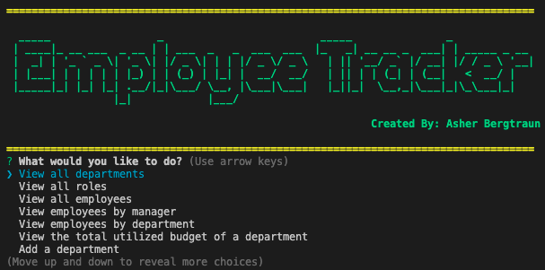

# Project Title
employee-tracker


# Description
This command-line application is designed to to manage a company's employee database, using Node.js, Inquirer, and MySQL.
This is purely a back end application that is not deployed and therefore can only be demonstrated using the command line.



Follow this [link](https://github.com/abergtra/challenge-12) for the GitHub repository.

# Table of Contents 
* [Installation](#-Installation)
* [Usage](#-Usage)
* [License](#-Installation)
* [Contributing](#-Contributing)
* [Tests](#-Tests)
* [Questions](#-Questions)
    
# Installation
Step #1: Run `npm install` in your command line. Ensure all required libraries are installed (express, sequelize, mysql2, etc).

Step #2: Start your mysql.

Step #3: Run `npm run seed` in your command line.

Step #4: Run `npm start` in your command line.

Step #5: Follow the command line prompts to use the content management system (CMS)!

# Usage
Explore the back end product's functionality by following the "Installation" instructions.
Once started, you can execute the following actions:

```bash
- View all departments
- View all roles
- View all employees
- View employees by manager
- View employees by department
- View the total utilized budget of a department
- Add a department
- Add a role
- Add an employee
- Delete a department
- Delete a role
- Delete an employee
- Update employee manager
- Update employee role
- Exit
```

Walkthrough:


A video walkthrough is also available if you follow this [link](https://youtu.be/v-NW6WWG8fc).

# License 
[License: MIT](https://opensource.org/licenses/MIT) 
* As this list provided is not comprehensive, if you need another license, contact the author for additional options. 


# Contributing 
Please contact the author about contributing.

# Tests
There are no tests available for this application.

# Questions
* GitHub Username: abergtra
* Contact Email: asher.bergtraun@gmail.com
